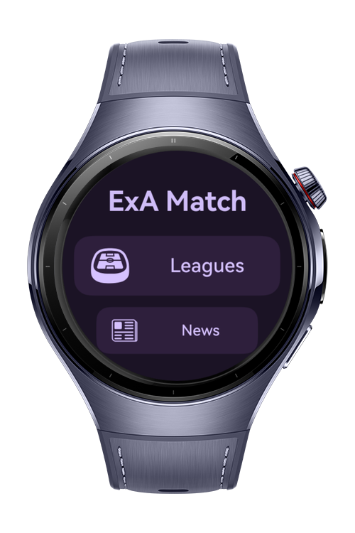
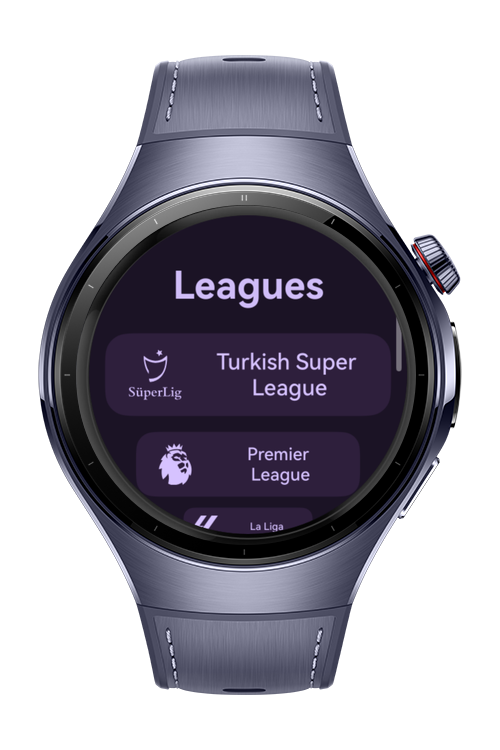
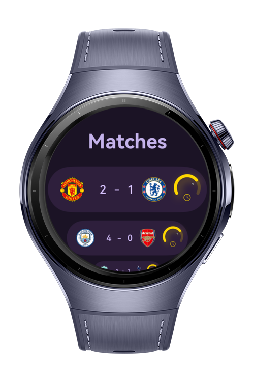

> **Note:** To access all shared projects, get information about environment setup, and view other guides, please visit [Explore-In-HMOS-Wearable Index](https://github.com/Explore-In-HMOS-Wearable/hmos-index).

# SoccerScore

SoccerScore is a demo app that allows users to follow all football leagues using Notification Kit, sending live updates for matches, scores, and events.

# Preview

<p align="left">
  
  
  
  
</p>

# Use Cases
SoccerScore lets users:
- Follow all major football leagues.
- Receive live notifications for match updates.
- Track favorite teams and games in real-time.

# Tech Stack
Languages: ArkTS  
Frameworks: HarmonyOS SDK 5.1.0(18)  
Tools: DevEco Studio Vers 5.1.0.820  
Libraries: @kit.ArkUI, @kit.NotificationKit

# Directory Structure

 ```
   entry/src/main/ets/
   |---commons
   |   |---RouteConstants.ets
   |---entryability
   |   |---EntryAbility.ets
   |---entrybackupability
   |   |---EntryBackupAbility.ets
   |---model
   |   |---ListModel.ets
   |   |---MatchModel.ets                            
   |   |---PlayerModel.ets  
   |   |---StandingsModel.ets  
   |---pages
   |   |---Index.ets
   |   |---LeagueCategory.ets                            
   |   |---Matches.ets
   |   |---News.ets                            
   |   |---Players.ets
   |   |---Second.ets
   |   |---Standings.ets                            
   |---view
   |   |---CustomText.ets
   |---viewmodel   
   |   |---NotificationViewmodel.ets
   |   |---SecondsService.ets
   |   |---TopScorerViewmodel.ets
   ```


# Constraints and Restrictions
## Supported Devices
Huawei Watch 5

# LICENSE

SoccerScore is distributed under the terms of the MIT License.  
See the [LICENSE](/LICENSE) for more information.
